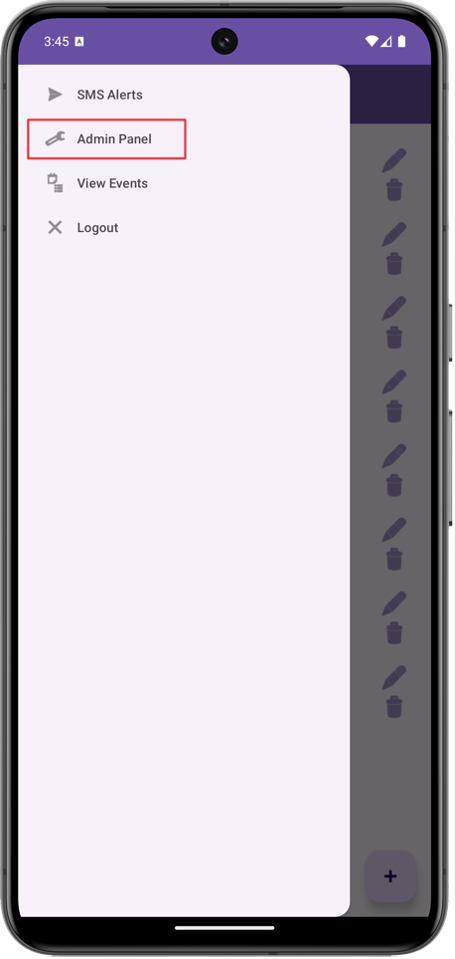
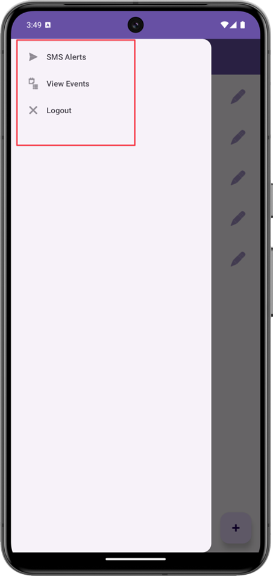
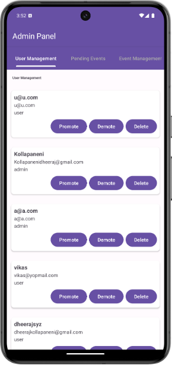
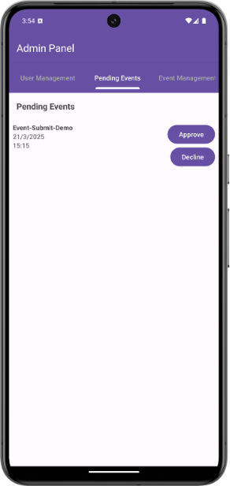
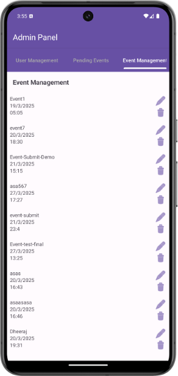
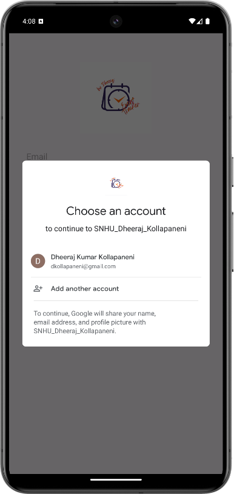
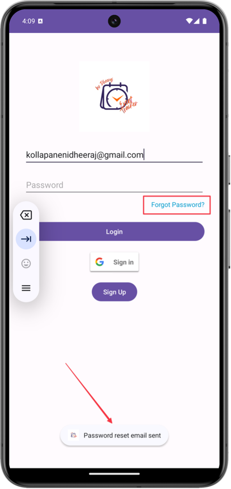
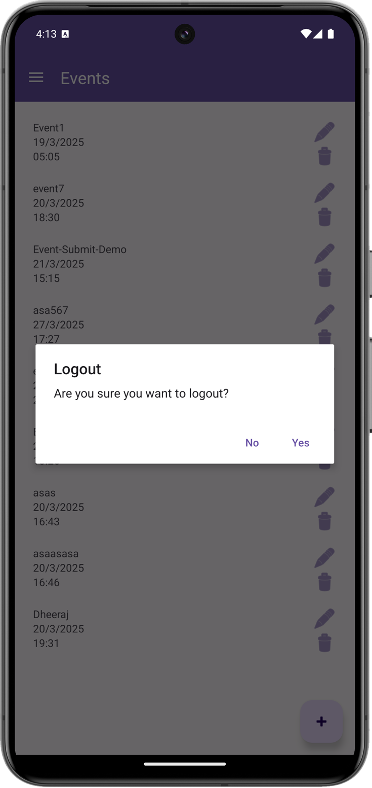
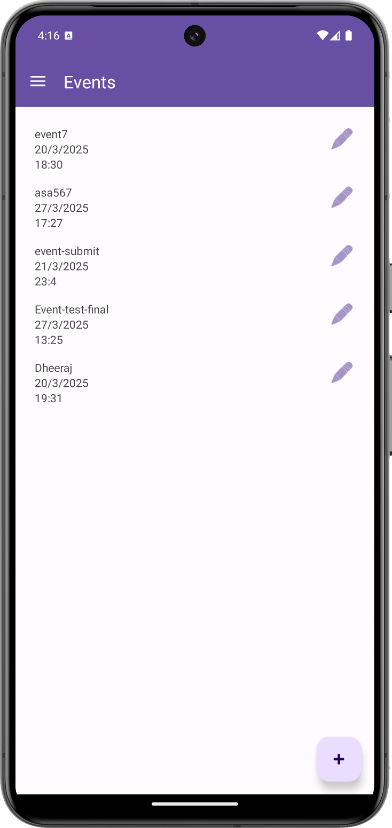
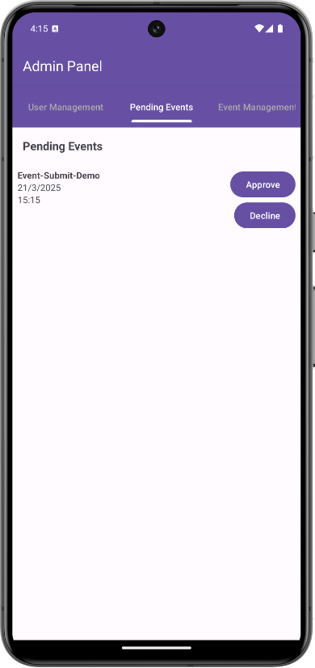

# 📌 Artifact 1: Software Design / Engineering

### 🧠 Enhancement Focus
**Enhancement One: Software Design/Engineering**

---

### 📝 Summary

I selected an Android-based event management application as my artifact for enhancement. Initially, the application allowed users to create and view events but lacked essential features such as:

- Role-based access control  
- Secure authentication  
- Event approval workflows  
- Usability improvements

The goal of my enhancements was to improve security, user management, and overall usability, making the application more structured and user-friendly.

---

### 🔐 Role-Based Access Control

To strengthen access control, I implemented **role-based authorization**:
- Only **admins** can access the Admin Panel.
- Admins can approve, reject, edit, or delete events.
- Admins can manage users (promote/demote/delete).
- Regular users can submit/edit events — **but these are hidden until approved**.

  
  

---

### 🛠️ Admin Panel

The Admin Panel includes three tabs:
1. **User Management** – View users, promote/demote/delete  
2. **Pending Events** – Approve or reject events  
3. **Event Management** – Full access to all events

  
  
  

---

### 🔐 Google Sign-In & Password Reset

Key authentication enhancements:
- **Google Sign-In** for quick login
- **Forgot Password** via Firebase email reset

  
  

---

### 🔁 Logout Confirmation

To improve usability, I added a **logout confirmation dialog** to prevent accidental logouts.

  

---

### 📆 Admin-Only Event Visibility

- Admins can review and approve user-submitted events.
- Unapproved events are **hidden from regular users**.
- Approved events are shown in the public event list.

  
  

---

### ⚙️ Engineering Challenges Solved

Throughout the process, I:
- Applied software design principles (security, structure, usability).
- Handled **Firebase authentication errors**.
- Resolved **Google Sign-In error code 10** by fixing SHA-1 config.
- Refined UI layouts for a better user experience.

---

### ✅ Final Outcome

These enhancements demonstrate my ability to:

- Design and implement secure, structured mobile applications  
- Apply cloud-based authentication (Firebase, Google Sign-In)  
- Implement scalable user access control (RBAC)  
- Improve usability and app workflow

---
